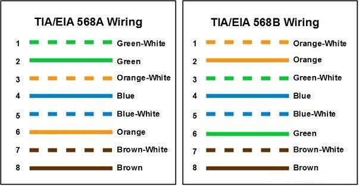
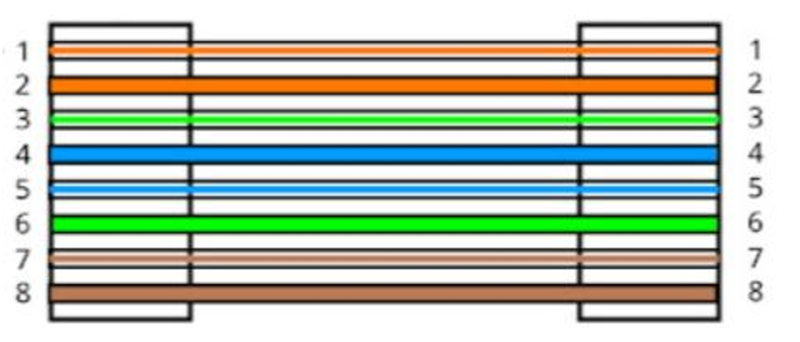
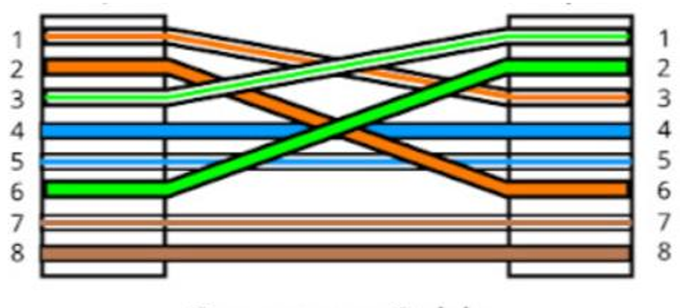

### Problem Statement 

Prepare straight-through cable and cross-over cable using CAT5 cable and RJ45 connectors and write a report on it.

### Theory

In network cabling, two common types of cables are used to connect devices:  straight-through cables and cross-over cables. Straight-through cables are primarily used to  connect different types of devices, such as a computer to a switch or router. Cross-over  cables are used to connect similar devices, such as computer to computer or switch to switch.  This report outlines the process of preparing both types of cables using CAT5 cable and RJ45  connectors.

### Materials Required:
- CAT5 Ethernet cable
- RJ45 connectors
- Crimping tool
- Wire cutter/stripper

### Straight-Through Cable:

Straight-through cables follow the same wiring standard on both ends. The two standards are T568A and T568B. The most commonly used standard is T568B.

**Steps**
- Use the wire stripper to strip about 1 inch of the outer insulation from the cable ends, exposing the twisted pairs.
- Untwist the pairs and align them according to the T568B color order.
- Trim the wires evenly to about 0.5 inches.
- Carefully insert the wires into the RJ45 connector, ensuring each wire goes into the correct slot.
- Use the crimping tool to crimp the connector onto the cable. Ensure the contacts pierce the insulation of each wire.
- Repeat the above steps for the other end of the cable.
- Use a cable tester to ensure the cable is functioning correctly.

### Crossover Cable:

Cross-over cables use different wiring standards on each end. One end uses T568A, and the other uses T568B.

**Steps**
- Strip about 1 inch of the outer insulation from both ends.
- Align the wires of the first end according to the T568A standard.
- Trim the wires evenly to about 0.5 inches.
- Insert the wires into the RJ45 connector, ensuring correct placement.
- Crimp the connector using the crimping tool.
- Align the wires of the second end according to the T568B standard.
- Trim the wires evenly to about 0.5 inches.
- Insert the wires into the RJ45 connector.
- Crimp the connector onto the cable.
- Use a cable tester to ensure the cable is functioning correctly

### Conclusion

The straight-through cable is suitable for connecting a computer to a switch or router, while the crossover cable is used for connecting two computers directly or for connecting similar devices. Both cables were prepared successfully and can be used for their respective purposes.

### References

[Straight-through, Crossover & Rollover Cable Pinouts Explained | Computer Cable Store](https://www.computercablestore.com/straight-through-crossover-and-rollover-wiring)
